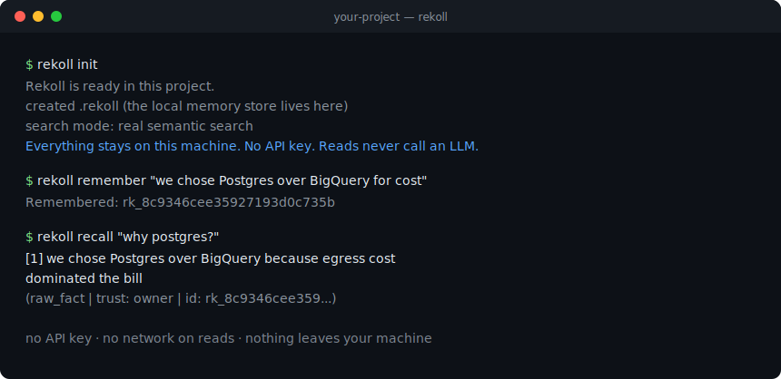

# Rekoll

**Injection-hardened, storage-agnostic, private memory for AI agents.**
Give your agent durable memory of a whole codebase + database — that it can't be tricked into trusting, and that never leaves your infrastructure.

[](https://github.com/rekreatedigital/rekoll/actions/workflows/ci.yml)
[](LICENSE)


[](SECURITY.md)

<p align="center">
  
</p>

> **Status: pre-alpha, but usable.** Working today: the `rekoll` CLI, the
> `Memory` facade, local semantic + keyword (hybrid) search with cross-encoder
> reranking, the injection firewall, a bring-your-own-database adapter contract,
> an MCP server, and a benchmark gate. Upcoming: the learning loop, more DB
> backends, and the no-Python `npx` wrapper — see
> [docs/DESIGN.md](docs/DESIGN.md). On PyPI since v0.1.0: `pip install rekoll`.

---

## What makes Rekoll different

It aims to be the first agent-memory layer that is *all five at once*:

- **Storage-agnostic** — one adapter contract; SQLite by default, point it at Postgres / Supabase / your own DB.
- **Private by default** — local store, local embeddings, no telemetry; your data never leaves your machine.
- **Hybrid** — fast local recall now, with an *optional* learning loop later (never on the read path).
- **Injection-hardened** — memory-poisoning defenses on by default (the gap no major memory library fills).
- **Human-legible** — content is verbatim and auditable, never an opaque blob.

## How you'll use it (three doors, one engine)

1. **MCP server** (the vibe-coder default) — one small config file in Claude Code / Cursor / Windsurf, **no Python code and no API key required**. *(`pipx install "rekoll[mcp]"` — see [docs/MCP.md](docs/MCP.md); the Node/`npx` wrapper that hides Python entirely is still coming.)*
2. **CLI + Python SDK** *(shipped)* — `rekoll init` in any repo — website, mobile app, agent — or `from rekoll import Memory` in Python. `pip install rekoll` and go.
3. **Self-host service** — one container pointed at your own database.

**Do you need an AI key?** No — saving and searching memory uses a local model, no key, no internet, free. Only the *optional* learning loop calls an LLM, and you can bring any model (OpenAI, Claude, Gemini, local Ollama, …) or run it locally.

*One honest caveat:* the recommended `[embeddings]` extra installs FastEmbed, which downloads the `BAAI/bge-small-en-v1.5` embedder (~tens of MB) from Hugging Face the first time you embed, then caches it — so that very first write/recall needs the network. After that one download, normal recall is fully offline and makes no further network calls. (The extra also bundles a small cross-encoder reranker, but under the default `auto` setting it stays off in normal hybrid recall, so its model is fetched only if a scope ever degrades to lexical-only.) Keyword-only mode — install without the extra — downloads nothing at all.

## Quickstart

**Install** (from [PyPI](https://pypi.org/project/rekoll/)):

```bash
pipx install "rekoll[embeddings,mcp]"  # CLI + MCP, in its own environment (recommended)
pip install "rekoll[embeddings]"       # Python SDK — into your project's venv
pip install rekoll                     # keyword search, zero dependencies
```

`pipx` keeps Rekoll's dependencies out of the Python you use for everything
else — a plain `pip install` with no virtualenv active can upgrade a shared
package as a side effect. The catch: a pipx install is invisible to `import
rekoll`, so if you want the **Python SDK** below, `pip install` into your
project's virtualenv instead. `[embeddings]` is what makes search semantic.

(Bleeding edge, straight from git:
`pip install "rekoll[embeddings] @ git+https://github.com/rekreatedigital/rekoll"`.)

**Vibe-coding? Don't install anything — paste this to your AI** (Claude Code,
Cursor, Windsurf, …) and let it do the whole setup:

```text
Please set up Rekoll — a private, local memory layer for AI agents
(https://rekoll.dev) — in this repository:

1. Install it (Python 3.10+), without touching my global Python:
   pipx install "rekoll[embeddings,mcp]"
   (no pipx? create a virtualenv for this project first, then use pip)
2. From the repo root, run:  rekoll init
   then index the project:   rekoll ingest .
3. If you support MCP, connect yourself to it. The portable way is a
   .mcp.json file in the repo root — create it if it isn't there:
   { "mcpServers": { "rekoll": { "command": "rekoll-mcp", "args": [] } } }
   (If you have the claude CLI, this does the same:
      claude mcp add rekoll -- rekoll-mcp
    other tools: https://github.com/rekreatedigital/rekoll/blob/main/docs/MCP.md)
4. Run rekoll status and rekoll doctor, and show me both outputs.

From now on in this repo: check memory before starting work (recall, and the
board tool to see what other sessions did), and save important decisions with
remember. Everything stays on this machine; searches are free and never call
an LLM.
```

**60 seconds, any project** — website, mobile app, agent repo; no Python code needed:

```bash
cd your-project
rekoll init          # one-time setup: creates ./.rekoll/ and the (empty) store, git-ignores it, tells you your search mode
rekoll remember "we chose Postgres over BigQuery for cost"
rekoll recall "why postgres?"
rekoll ingest .      # optional: index this whole repo (code + docs)
rekoll status        # what's stored here
```

`rekoll recall --context` prints a safe, LLM-ready block you can paste (or pipe)
into any AI tool; `rekoll recall --json` emits
`{context, directives, ids, mode, count, abstained, top_vector_score}` for
scripts — the same keys the MCP `recall` tool returns. `mode` names the search
pipeline that actually ran, so a degraded index can't hide; `directives` carries
your standing rules; `abstained`/`top_vector_score` expose the abstain gate. And
`rekoll doctor` checks your setup if anything misbehaves.

**Same store, from Python:**

```python
from rekoll import Memory

mem = Memory()               # local SQLite, firewall on, zero config — the CLI's defaults
mem.remember("we chose Postgres over BigQuery for cost")
mem.remember("the deploy runs on a Hostinger VPS")

print(mem.recall("why postgres?").texts()[0])          # the right memory, by meaning
print(mem.recall("where does it deploy?").context())   # LLM-ready, safe data envelope
```

Reads need **no API key and call no LLM** — everything stays on your machine.

### Bring your own AI (optional)

If you *want* cloud AI, plug in any provider's key — explicitly, with zero new
dependencies. The no-key local default never changes, and cloud is opt-in only:
the default path never reads a key or opens a socket (CI-gated).

```python
# docs: no-run — this one needs a provider API key
from rekoll import Memory
from rekoll.providers import OpenAICompatibleConsolidator  # merge memories with YOUR LLM

mem = Memory(embedder="openai:text-embedding-3-small")     # key from OPENAI_API_KEY
mem.consolidate(query="database decisions",
                consolidator=OpenAICompatibleConsolidator("gpt-4o-mini"))
```

OpenAI, DeepSeek, Qwen, Mistral, Gemini, Voyage (the embeddings answer for
Claude users), Ollama / LM Studio, any OpenAI-compatible `base_url`, … — see
[docs/PROVIDERS.md](docs/PROVIDERS.md). Consolidation output stays auditable:
firewall-screened, provenance-linked to its sources, trust capped at the
minimum of what went in — an LLM can never promote its own words.

More recipes (per audience, copy-paste): **[docs/QUICKSTART.md](docs/QUICKSTART.md)**.
Point Rekoll at your own database later via `Memory(backend=...)` (Postgres/Supabase
adapters land in a later phase).

Bulk-ingested files are treated as **third-party** by default: they land at
`UNVERIFIED` trust so the firewall can quarantine any injection markers they
contain, and they never reach the recall envelope's instruction channel. Vouch
for a tree you control with `mem.ingest_path(".", trust=TrustTier.CURATED)`. Your
own first-person notes via `mem.remember(...)` stay at `OWNER` (see
[ADR-0016](docs/adr/0016-ingest-trust-default.md)).

**PII redaction is opt-in, not on by default.** Secrets (API keys, tokens,
private-key blocks, database DSNs) are *always* stripped before anything is
stored. Emails, US SSNs and phone numbers are kept verbatim by default —
default-on redaction would corrupt code ingestion (author emails, `CODEOWNERS`,
number sequences). Turn PII redaction on per write with `rekoll remember
--redact-pii` / `rekoll ingest --redact-pii`, or for the whole MCP server with
`rekoll-mcp --redact-pii` (or `REKOLL_MCP_REDACT_PII=1`). Redaction keeps a
non-reversible audit tag, never the raw value (ADR-0022, refined by ADR-0033).

### Use from any agent (MCP)

Any MCP-capable agent (Claude Code, Cursor, Windsurf, …) can use Rekoll as its
memory — no Python code to write:

```bash
pipx install "rekoll[mcp]"               # or pip; -e from a clone while developing
```

Then create `.mcp.json` in your project root — Claude Code picks it up
automatically (a one-time approval prompt, then it just works), and everyone
who clones the repo inherits it:

```json
{ "mcpServers": { "rekoll": { "command": "rekoll-mcp", "args": [] } } }
```

With the `claude` CLI, `claude mcp add rekoll -- rekoll-mcp` registers the same
thing. Prefer the file if you're unsure — Claude Code's VS Code extension puts
no `claude` on your PATH. Other clients: docs/MCP.md.

The agent gets six tools (`remember`, `recall`, `ingest_path`, `forget`,
`status`, `board`) over this project's private store. Scope and trust are pinned
server-side — the calling model can't hop projects or promote its own writes,
and everything it recalls arrives as firewalled DATA, never instructions. Setup
for Cursor + generic clients, the trust model, and all knobs: **[docs/MCP.md](docs/MCP.md)**.

### Develop Rekoll itself

```bash
git clone https://github.com/rekreatedigital/rekoll && cd rekoll
python -m venv .venv && . .venv/Scripts/activate   # or: source .venv/bin/activate
pip install -e ".[dev,embeddings]"
pytest
```

## Docs & policies

- [Quickstart recipes](docs/QUICKSTART.md) · [Design document](docs/DESIGN.md) · [Architecture Decision Records](docs/adr/)
- [Security policy](SECURITY.md) · [Changelog](CHANGELOG.md) · [Non-goals](NON_GOALS.md) · [Contributing](CONTRIBUTING.md)

## License

[MIT](LICENSE) © [Rekreate Digital](https://rekreatedigital.com). You own and are responsible for whatever data you store with Rekoll.

---

<p align="center">
  Built and maintained by <a href="https://rekreatedigital.com"><strong>Rekreate Digital</strong></a><br>
  <sub>We design and build AI systems that hold up in production —
  <a href="https://rekreatedigital.com">work with us</a>.</sub>
</p>

<sub>Rekoll is not affiliated with <a href="https://www.recoll.org/">Recoll</a>, the desktop full-text search tool.</sub>
